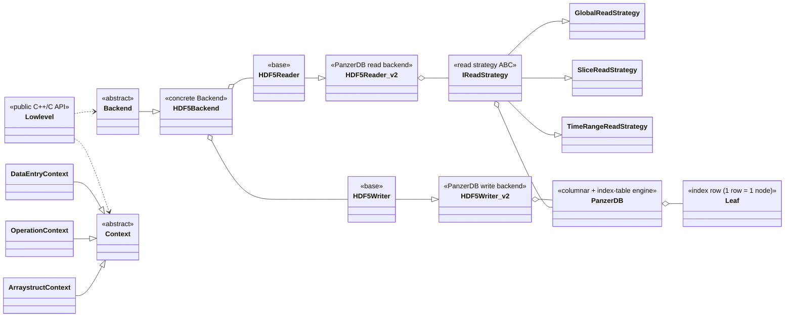

# IMAS-Core HDF5 backend (v2) — Class diagram & class reference

**Scope:** the read/write path of the *columnar / compact-index* ("PanzerDB") backend,
i.e. what sits behind the public `libal` C API. All classes below are real, current
members of the build (`include/` and `src/hdf5/`); signatures were checked against the
live headers on 2026-09-07.

**Purpose:** reference material for a presentation slide. English.

---

## 1. Class diagram (Mermaid)

> Render any of these in a Mermaid-compatible viewer (GitHub, VS Code "Mermaid" preview,
> excalidraw-metabase, draw.io import, `@mermaid-js/mermaid-cli`, etc.).

### 1.a. Full class diagram

```mermaid
classDiagram
    direction LR

    %% ===== Public AL layer =====
    class Lowlevel {
        <<static facade, al_lowlevel.h>>
        +addLLenv(Backend*, Context*) int
        +getLLenv(int) LLenv
        +delLLenv(int) LLenv
        +setValue() / setDefaultValue() / convertData()
        +createAOS()
        +C API: al_write_data() / al_read_data() / al_begin_*_action()
    }
    class LLenv {
        <<struct, al_lowlevel.h>>
        Backend* backend
        Context* context
    }
    class LLplugin {
        <<plugin mgmt, al_lowlevel.h>>
        +registerPlugin() / bindPlugin()$
        +begin*ActionPlugin()$
    }

    %% ===== Backend abstraction =====
    class Backend {
        <<abstract, al_backend.h>>
        +getVersion()$
        +openPulse()$
        +closePulse()$
        +beginAction()$
        +endAction()$
        +writeData()$
        +readData()$
        +deleteData()$
        +beginArraystructAction()$
        +get_occurrences()$
        +supportsTimeRangeOperation()$
    }
    class HDF5Backend {
        <<concrete, hdf5_backend.h, extends Backend>>
        +HDF5Writer* hdf5Writer
        +HDF5Reader* hdf5Reader
        +HDF5EventsHandler* eventsHandler
        +writeData() / readData()
        +beginReadArraystructAction()
        +beginWriteArraystructAction()
    }
    class HDF5BackendFactory {
        <<factory, version-based>>
        +createWriter() unique_ptr~HDF5Writer~
        +createReader() unique_ptr~HDF5Reader~
        +createEventsHandler()
    }

    %% ===== Contexts =====
    class Context {
        <<abstract, al_context.h>>
        +getType()*
    }
    class DataEntryContext {
        <<CTX_PULSE_TYPE>>
    }
    class OperationContext {
        <<CTX_OPERATION_TYPE: dataobject + datapath + accessmode>>
        +getDataobjectName() / getDatapath() / getAccessmode()
    }
    class ArraystructContext {
        <<CTX_ARRAYSTRUCT_TYPE: AoS element index + timebase>>
        +getIndex() / getTimed() / getTimebasePath() / getParent()
    }

    %% ===== Writer =====
    class HDF5Writer {
        <<base / v1, hdf5.h>>
        +write_ND_Data()*
        +beginWriteArraystructAction()*
        +endAction()*
        +setWriteStrategy()*
    }
    class HDF5Writer_v2 {
        <<PanzerDB-based, hdf5_writer_v2.h>>
        +unique_ptr~PanzerDB~ panzer_db_ptr
        +write_ND_Data()
        +beginWriteArraystructAction()
        +endAction()
        +setWriteStrategy()
    }

    %% ===== Reader =====
    class HDF5Reader {
        <<base / v1, hdf5.h>>
        +read_ND_Data()*
        +beginReadArraystructAction()*
        +endAction()*
    }
    class HDF5Reader_v2 {
        <<PanzerDB-based, hdf5_reader_v2.h>>
        +unique_ptr~GlobalReadStrategy~ global_strategy
        +unique_ptr~SliceReadStrategy~ slice_strategy
        +unique_ptr~TimeRangeReadStrategy~ timerange_strategy
        +IReadStrategy* read_strategy "active"
        +read_ND_Data()
        +build_path_index()
        +select_strategy()
    }

    %% ===== Strategies (Strategy pattern) =====
    class IReadStrategy {
        <<abstract strategy, iread_strategy.h>>
        +unique_ptr~PanzerDB~ panzer_db_ptr
        +map~path, vector_of_Leaf_ptr~ path_cache "path -> leaves"
        +read_ND_Data()*
        +beginReadArraystructAction()*
        +endAction()*
        +find_leaf_for_context()
        +build_path_index()
        +getTimeValues()
        +getHomogeneousTime()
        +sanitize_path()
        +buildFullPath()
    }
    class GlobalReadStrategy {
        +read_ND_Data() "all time slices"
    }
    class SliceReadStrategy {
        +read_ND_Data() "one time slice"
        - getIndices()
    }
    class TimeRangeReadStrategy {
        +read_ND_Data() "resample over [tmin,tmax]"
        - time_basis_vector
        - getIndices()
    }

    %% ===== Engine =====
    class PanzerDB {
        <<columnar + index-table engine, panzerdb.h>>
        +enum OpenMode {WRITE, READ, APPEND}
        +writeData() / writeDataSlices()
        +writeMetadata() / readMetadata()
        +beginArray() / endArray() / incrementArrayIndex()
        +flush() / close()
        +readTensor~T~() / readSliceDirect()
        +readScalar~T~()
        +readDataByIndex() / readStringDataByIndex()
        +readInterpolatedData()
        +getWholeDynamicSignal()
        +getTimeIndex() / nearestAvailableSliceIndex()
        +getLeaves() Leaf*
    }
    class Leaf {
        <<index row: self-describing node, panzerdb.h>>
        +shape
        +time_index
        +path
        +parent_path
        +offset
        +count
        +flags "kind (lo 4 b) + DataType (high)"
        +is_empty
    }

    %% ===== Relationships =====
    Lowlevel "1"   *--  "N" LLenv          : llenvStore
    Lowlevel "1"   *--  "0..N" LLplugin    : llpluginsStore
    LLenv          -->  Backend  : backend
    LLenv          -->  Context  : context
    Lowlevel       ..> Backend : dispatches via ctx id
    Lowlevel       ..> Context : dispatches via ctx id

    Backend        <|--  HDF5Backend
    HDF5Backend    "1"  o--  "1" HDF5Writer
    HDF5Backend    "1"  o--  "1" HDF5Reader
    HDF5Backend    "1"  o--  "1" HDF5EventsHandler
    HDF5BackendFactory ..> HDF5Writer : creates (v1 or v2)
    HDF5BackendFactory ..> HDF5Reader : creates (v1 or v2)
    HDF5Backend    ..>  DataEntryContext
    HDF5Backend    ..>  OperationContext
    HDF5Backend    ..>  ArraystructContext

    Context        <|--  DataEntryContext
    Context        <|--  OperationContext
    Context        <|--  ArraystructContext

    HDF5Writer     <|--  HDF5Writer_v2
    HDF5Reader     <|--  HDF5Reader_v2

    HDF5Writer_v2  "1"  o--  "1" PanzerDB : write session
    HDF5Reader_v2  "1"  o--  "0..3" IReadStrategy : one per range mode
    HDF5Reader_v2  -->  IReadStrategy : active read_strategy
    IReadStrategy  <<|*  GlobalReadStrategy
    IReadStrategy  <<|*  SliceReadStrategy
    IReadStrategy  <<|*  TimeRangeReadStrategy
    IReadStrategy  "1"  o--  "1" PanzerDB : read session

    PanzerDB       "1"  o--  "N" Leaf      : /index rows
```

The two composition arrows into `PanzerDB` (green: from writer and from reader) are the
**load-bearing** edges — the entire v2 backend funnels I/O through a single `PanzerDB`
instance (writer) or strategy-owned `PanzerDB` (readers), which in turn owns the on-disk
`/index`, `/paths` and `data_raw_*` datasets.

### 1.b. Simplified "one slide" version

If the full diagram is too dense for a single slide, use this:



---

## 2. Class reference

Legend for "kind":
- **A** — abstract
- **C** — concrete
- **S** — static
- **E** — embedded struct / enum

### 2.1. Public AL layer

| Class | File | Kind | Responsibility |
|---|---|---|---|
| `Lowlevel` | `include/al_lowlevel.h` | A, S | Facade over the backend. Owns the `(Backend, Context)` **store** used to turn opaque C-integer context ids into C++ pointers. C entry points `al_write_data`, `al_read_data`, `al_begin_{global,slice,timerange,arraystruct}_action`, `al_end_action`, `al_plugin_*`, `al_register_plugin`, … Dispatch: `ctx id → LLenv → backend → method`. |
| `LLenv` | `include/al_lowlevel.h` | E | The record stored by `Lowlevel::addLLenv(Backend*, Context*)`. Holds the two pointers (`backend` and `context`) that bind a concrete backend implementation to the AL context for the duration of a session. |
| `LLplugin` | `include/al_lowlevel.h` | S | The "low-level plugin" framework: registers C plugins (`al_plugin_begin_global_action`, `readDataPlugin`, `writeDataPlugin`, …) and lets them be *bound* to specific field paths (`bindPlugin(fieldPath, name)`) or to dataobject paths. Independent of the backend, used by `Lowlevel` when dispatching. |

### 2.2. Backend abstraction (AL contract)

| Class | File | Kind | Notes |
|---|---|---|---|
| `Backend` | `include/al_backend.h` | A | The **AL contract**: pure virtual `openPulse`, `closePulse`, `beginAction`, `endAction`, `writeData`, `readData`, `deleteData`, `beginArraystructAction`, `get_occurrences`, `supportsTimeDataInterpolation`, `supportsTimeRangeOperation`. Every backend implementation provides these. |
| `HDF5Backend` | `src/hdf5/hdf5_backend.h` | C | Concrete Backend for IMAS HDF5. Owns one **writer** (`unique_ptr<HDF5Writer>`), one **reader** (`unique_ptr<HDF5Reader>`) and one events handler. Routes `writeData`/`readData` calls to whichever side they belong to, using `ctx->getOperationContext()->getAccessmode()`. |
| `HDF5BackendFactory` | `src/hdf5/hdf5_backend_factory.h` | C | Chooses the *concrete* writer/reader **by backend version**: `createWriter()` returns a unique_ptr that points either to `HDF5Writer` (v1, raw HDF5) or `HDF5Writer_v2` (PanzerDB). Same for `createReader()`. That's how "v2" is selected — nothing else to do. |

### 2.3. Contexts

The context hierarchy is a small, **stable** tree that all backends (v1 and v2) read:

```
Context (abstract)
├── DataEntryContext    (CTX_PULSE_TYPE,  a "pulse" / a file)
├── OperationContext    (CTX_OPERATION_TYPE,  one dataobject + partial datapath + access mode)
└── ArraystructContext  (CTX_ARRAYSTRUCT_TYPE, one element of an AoS; knows its index + parent + timebase)
```

| Class | Kind | Key methods used by v2 |
|---|---|---|
| `Context` | A | `getType()` — returns `CTX_PULSE_TYPE` / `CTX_OPERATION_TYPE` / `CTX_ARRAYSTRUCT_TYPE`. The **single** hook the v2 code uses to identify what it's holding. |
| `DataEntryContext` | C | The *pulse*. Carries the URI/file. Not read directly by v2 except in `openPulse`/`closePulse`. |
| `OperationContext` | C | `getDataobjectName()`, `getDatapath()`, `getAccessmode()` (`READ_OP`/`WRITE_OP`/`REPLACE_OP`), plus slice/timerange parameters (time, tmin/tmax/dtime, interp mode). **HDF5Writer_v2::setWriteStrategy** and **HDF5Reader_v2::select_strategy** key on `getAccessmode()`. |
| `ArraystructContext` | C | `getIndex()` (position inside the AoS), `getTimed()`, `getTimebasePath()`, `getParent()`. These are the primitives the v2 strategy uses to **reconstruct the full instance path** (`"A/0/B/2/dataset"` style) that is the key of the PanzerDB `path_cache`. |

### 2.4. Writer path (v1 → v2)

| Class | File | Kind | Responsibility |
|---|---|---|---|
| `HDF5Writer` | `src/hdf5/hdf5_writer.h` | A | Base, **v1**: owns `HDF5DataSetHandler`, per-context `tensorized_paths`, `arrctx_shapes`, `dynamic_AOS_slices_extension` maps. Provides raw-HDF5 dataset management (create/update/extend chunked datasets, `H5D` hyperslab writes). Pure virtual `write_ND_Data`, `beginWriteArraystructAction`, `endAction`, `setWriteStrategy`. |
| `HDF5Writer_v2` | `src/hdf5/hdf5_writer_v2.h` | C | **PanzerDB writer.** Exactly one `unique_ptr<PanzerDB> panzer_db_ptr` per session. `GLOBAL_OP` → `PanzerDB(…, WRITE, …)`; `SLICE_OP` → `PanzerDB(…, APPEND, …)`. `write_ND_Data` calls `panzer_db_ptr->writeData(name, shape, data)` (or `writeDataSlices` for timed signals, `writeMetadata` for `@key`s). `beginWriteArraystructAction` calls `panzer_db_ptr->beginArray(name, size)` (static) or `beginArray(name, timebase)` (dynamic). `endAction` does `panzer_db_ptr->endArray()` (AoS close) or `flush()+close()` (top). Static `compression_enabled`, `write_chunk_cache_size` flow into `PanzerDB::createOptimizedDataset`. |

### 2.5. Reader path (v1 → v2)

| Class | File | Kind | Responsibility |
|---|---|---|---|
| `HDF5Reader` | `src/hdf5/hdf5_reader.h` | A | Base, **v1**: owns `HDF5DataSetHandler`, `HDF5HsSelectionReader`, `DataInterpolation`, and the v1 "tensorized path" bookkeeping. Pure virtual `read_ND_Data`, `beginReadArraystructAction`, `endAction`. Used in production only for **v1 files**; the v2 files don't touch it at all. |
| `HDF5Reader_v2` | `src/hdf5/hdf5_reader_v2.h` | C | **PanzerDB reader.** Owns three strategies (**one per operation range mode**, lazily created): `global_strategy`, `slice_strategy`, `timerange_strategy`, plus a raw pointer `read_strategy` that is the *currently active* one for the session. Selects the strategy in `prepare_strategy(ctx)` using `OperationContext::getAccessmode()`. `open_IDS_group` calls the base-class file-group open to get a `hid_t`, then hands that to the selected strategy. All `read_ND_Data` and `beginReadArraystructAction` calls are forwarded to the active strategy. |

### 2.6. Read strategies (the *Strategy* pattern in v2)

| Class | File | Kind | Notes |
|---|---|---|---|
| `IReadStrategy` | `src/hdf5/iread_strategy.h` | A | **ABC + shared infrastructure.** Holds `unique_ptr<PanzerDB> panzer_db_ptr` (opened in READ mode in its ctor), two cache maps (`path_cache: path → vector<const Leaf*>` for O(1) leaf lookups; `context_path_cache`, `sanitized_path_cache`, `time_values_cache`, `schema_aos_paths`), and the pure-virtual `read_ND_Data(ctx, ds, timebase, dtype, data, dim, size)`. **All the path reconstruction logic** (context → hierarchical `"A/0/B/2/dataset"` matching) is in this base, so it's shared. `find_leaf_for_context` builds the strict full path from the deepest context and probes the cache; `getTimeValues` finds the time-vector leaf (direct or per-index) and reads it (with a `HOMOGENEOUS_TIME` special key). |
| `GlobalReadStrategy` | `src/hdf5/global_read_strategy.h` | C | For **GLOBAL_OP** reads: `read_ND_Data` reads **the whole tensor** (every time slice) and returns it as a single flat array. |
| `SliceReadStrategy` | `src/hdf5/slice_read_strategy.h` | C | For **SLICE_OP** reads: `read_ND_Data` reads **one** time slice — the one whose `time_index` matches the requested `time` (with the operation's interpolation mode). Its own `getIndices(ctx, dynamic_index)` maps the requested time → `time_index` (via `panzer_db_ptr->getTimeIndex` or `nearestAvailableSliceIndex`), then reads the selected slice. |
| `TimeRangeReadStrategy` | `src/hdf5/timerange_read_strategy.h` | C | For **TIMERANGE_OP** reads: `read_ND_Data` reads the entire node and **resamples** over the requested time grid `[tmin, tmax]` (using the operation's `dtime` vector; IMAS-3885). Adds a `time_basis_vector` member; its own `getIndices` resolves the requested range to source `time_index` bounds. |

### 2.7. The store engine

| Class | File | Kind | Notes |
|---|---|---|---|
| `PanzerDB` | `src/hdf5/panzerdb.h` (impl in `.cpp`) | C | The **columnar + compact-index engine** that every v2 call ultimately goes to. On-disk: `/index` (row per node, self-describing), `/paths` (fixed-width C1, SWMR-safe), `/data_raw_{f64,i32,c128,str}` (one big chunked dataset per data type; `str` is **fixed-width 512B** since the SWMR work). Public API split into: **write** (`writeData`, `writeDataSlices`, `writeMetadata`), **time** (`advanceTimebase`, `getWholeDynamicSignal`), **AoS** (`beginArray` ×2, `endArray`, `incrementArrayIndex`, `synchronizeArrayStack`), **commit** (`flush`, `close`), **read** (`readTensor<T>`, `readSliceDirect`, `readScalar<T>`, `readDataByIndex`, `readStringDataByIndex`, `readIntDataByIndex`, `readComplexDataByIndex`, `readInterpolatedData`), **introspection** (`getLeaves`, `getAOSShape`, `getDynamicAOSSize`, `isDynamicAOS`, `getLeafType`), **time-mapping** (`getTimeIndex`, `nearestAvailableSliceIndex`), **metadata** (`writeMetadata`, `readMetadata`). Non-copyable, non-movable. |
| `PanzerDB::Leaf` | `src/hdf5/panzerdb.h` | E | The **row-of-the-index-table**. `shape` (per time slice), `time_index`, `path` & `parent_path` (zero-copy `string_view` into an internal path buffer), `offset` (position in the matching `data_raw_*` dataset), `count` (# stored elements), `flags` (low 4 bits: node kind — 0 data / 1 empty / 2 static-AoS / 3 dynamic-AoS; upper bits: `DataType`), plus `is_empty`. |
| `PanzerDB::OpenMode` | `src/hdf5/panzerdb.h` | E | `WRITE` (fresh file), `READ` (immutable), `APPEND` (extend an existing file, e.g. a new slice). |
| `PanzerDB::DataType` (from `direct_access_api`) | see include | — | Values encoded into the upper bits of `Leaf::flags`. |

### 2.8. Related (out of slide scope but visible)

| Class | Where | Notes |
|---|---|---|
| `HDF5DataSetHandler` | `src/hdf5/hdf5_dataset_handler.h` | v1 dataset accessor. Not exercised when `HDF5Backend` is routed through `HDF5Writer_v2`/`HDF5Reader_v2`. |
| `HDF5EventsHandler` | `src/hdf5/hdf5_events_handler.h` | Owns the low-level event dispatch for the pulse. Shared v1/v2. |
| `DataInterpolation` | see `src/` | Interpolates a slice between the stored `PREVIOUS` and `NEXT` slices. v1 uses it directly; v2 has its own resampling (in `TimeRangeReadStrategy`). |
| `MetadataExtractor` | `src/hdf5/metadata/metadata_extractor.h` | Parses the IMAS IDS definition; used by `HDF5Writer_v2::setWriteStrategy` in `GLOBAL_OP` to replay `@key` properties via `PanzerDB::writeMetadata`. |

---

## 3. Data flow (for speaker notes)

### 3.1. Write (`al_write_data`)

```
Lowlevel.al_write_data(ctx,…) 
   └─ getLLenv(ctx).backend->writeData(ctx, field, timebase, data,…)   (HDF5Backend)
        └─ hdf5Writer->write_ND_Data(ctx,att,time,dt,dim,size,data)     (HDF5Writer_v2)
             └─ panzer_db_ptr->writeData(name, shape, data)  /
                panzer_db_ptr->writeDataSlices(name, data, …)  /
                panzer_db_ptr->writeMetadata(path, value)      (PanzerDB)
                  └─ appended into disk datasets `/paths`, `/index`, and `data_raw_*`
```

### 3.2. Read (`al_read_data`)

```
Lowlevel.al_read_data(ctx,…)
   └─ backend->readData(ctx, field, timebase,…)                       (HDF5Backend)
        └─ hdf5Reader->read_ND_Data(ctx,att,time,…)                   (HDF5Reader_v2)
             ├─ prepare_strategy(ctx) — pick Global / Slice / TimeRange (based on op-ctx accessmode)
             └─ read_strategy->read_ND_Data(ctx, ds, tb, dt, data,…)  (IReadStrategy derived)
                  ├─ find_leaf_for_context(ctx) → path_cache lookup → const Leaf*
                  └─ panzer_db_ptr->readTensor<T>(leaf)  /
                     readSliceDirect(leaf, time_index) /
                     readInterpolatedData(…)                                  (PanzerDB)
```

### 3.3. Why "Strategy" fits here

The three concrete strategies differ only in the **time axis they address** (all / one / range+resample); they share the expensive path-cache, the context→path reconstruction, and the PanzerDB handle. Swapping the strategy is a one-line change in `HDF5Reader_v2::select_strategy`, and there's no need to fork the PanzerDB code.

---

## 4. Suggested slide layout

**Slide A — "Architecture overview"** → diagram 1.b (small). Legend on the right: *context*, *backend*, *writer*, *reader strategies*, *engine*. One-sentence caption: "v2 backend = PanzerDB columnar store + three read strategies, chosen by operation mode".

**Slide B — "Class hierarchy (full)"** → diagram 1.a. Zoom in on the two composition edges into `PanzerDB` (writer and strategies) — that's the **one-to-one** between v2 and the engine.

**Slide C — "Write path"** → a horizontal flow matching §3.1, with one arrow per class boundary.

**Slide D — "Read strategies"** → a table of the three strategies (global/slice/timerange) × their `read_ND_Data` contract × their private helpers.

**Slide E — "The engine"** → `PanzerDB` public API, grouped (write / time / AoS / commit / read / introspection / mapping) — 3 columns.

---

## 5. Key facts to keep on every slide

1. **v2 selection is version-driven** — `HDF5BackendFactory` decides; no runtime fork inside the backend.
2. **One `PanzerDB` per session** — the writer owns one, each strategy owns one. No shared mutable engine state across sessions.
3. **The path cache is the perf win** — `IReadStrategy::path_cache` is an `unordered_map<path, vector<const Leaf*>>`, filled once per strategy in `build_path_index()`, then every `read_ND_Data` is an O(1) map lookup instead of an O(#leaves) scan.
4. **The index is a self-describing table** — one `Leaf` row per node, holding `shape / time_index / offset / count / flags`. The reader never needs to iterate datasets to find a node; it maps *path* → *offset + count* into one of four `data_raw_*` arrays.
5. **SWMR-safe string column** — `data_raw_str` is now a fixed-width 512B C1 (was vlen UTF-8); the write path ends with an `H5Fflush(GLOBAL)` commit barrier. This is the single architectural change that made a shared-file writer visible to concurrent readers.

---

## 6. Source lines that back this up

| Class | Header line |
|---|---|
| `Lowlevel` | `include/al_lowlevel.h:127` |
| `LLenv` | `include/al_lowlevel.h:108` |
| `LLplugin` | `include/al_lowlevel.h:20` |
| `Backend` | `include/al_backend.h:31` |
| `HDF5Backend` | `src/hdf5/hdf5_backend.h:17` |
| `HDF5BackendFactory` | `src/hdf5/hdf5_backend_factory.h:14` |
| `Context` / `DataEntryContext` / `OperationContext` / `ArraystructContext` | `include/al_context.h:43 / 99 / 196 / 386` |
| `HDF5Writer` (base) | `src/hdf5/hdf5_writer.h:9` |
| `HDF5Writer_v2` | `src/hdf5/hdf5_writer_v2.h:23` |
| `HDF5Reader` (base) | `src/hdf5/hdf5_reader.h:14` |
| `HDF5Reader_v2` | `src/hdf5/hdf5_reader_v2.h:24` |
| `IReadStrategy` | `src/hdf5/iread_strategy.h:26` |
| `GlobalReadStrategy` | `src/hdf5/global_read_strategy.h:9` |
| `SliceReadStrategy` | `src/hdf5/slice_read_strategy.h:11` |
| `TimeRangeReadStrategy` | `src/hdf5/timerange_read_strategy.h:10` |
| `PanzerDB` | `src/hdf5/panzerdb.h:170` |
| `PanzerDB::Leaf` | `src/hdf5/panzerdb.h:192` |
| `PanzerDB::OpenMode` | `src/hdf5/panzerdb.h:428` |

*Report generated by Qwen Code on 2026-09-07 from headers read at the working tree `index_table_v2 @ 6fb6a9e` (branch state: `swmr-fixed-string-col` post-merge, commit `8db33b8`).*
