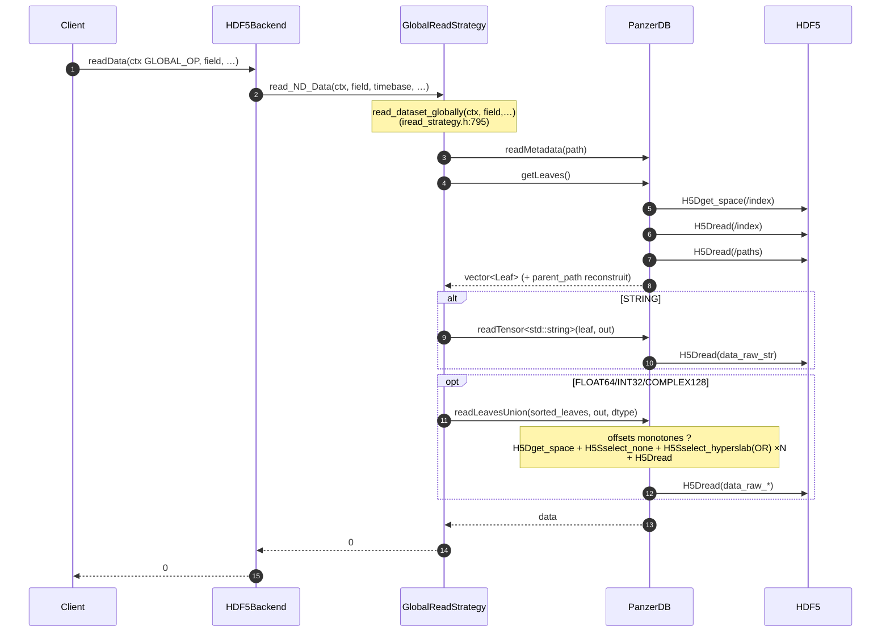
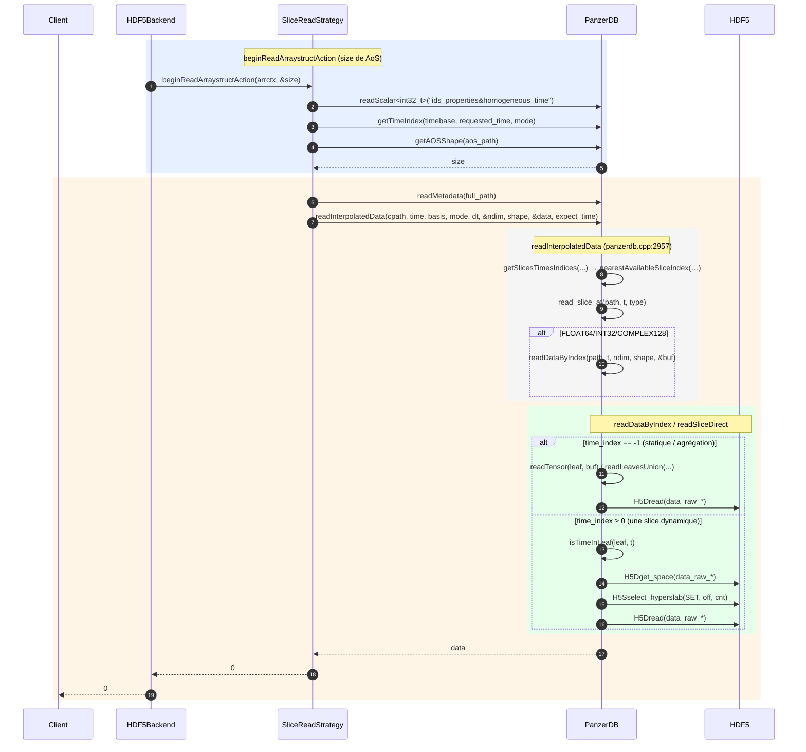
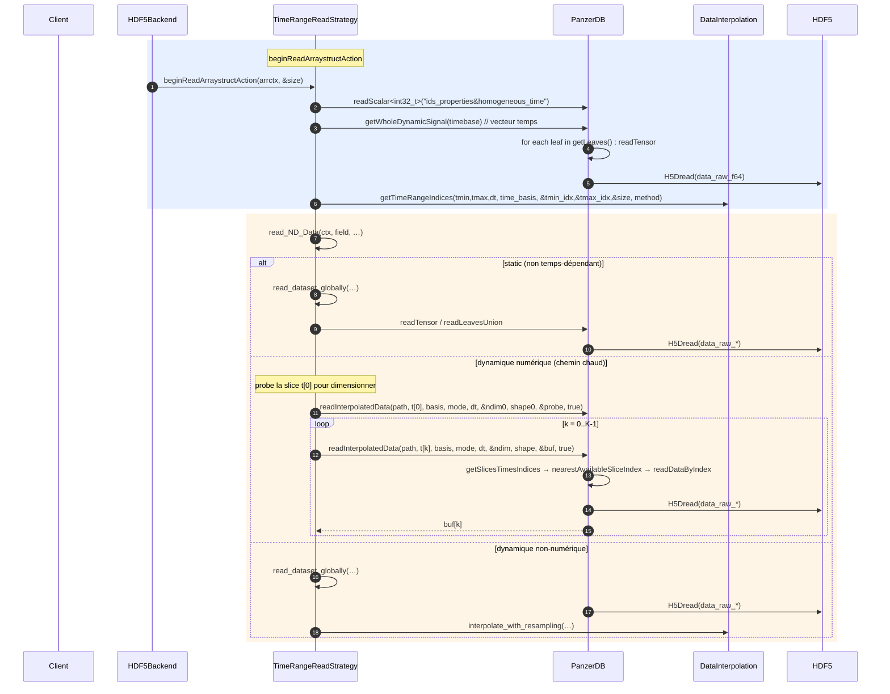
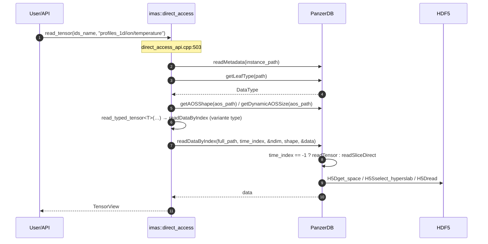

# PanzerDB — Stratégies de récupération des données (diagrammes de séquence)

> Source : `src/hdf5/` de IMAS-Core (backend v2). Le `PanzerDB` (moteur) est la couche
> de storage ; les **stratégies** (`GlobalReadStrategy`, `SliceReadStrategy`,
> `TimeRangeReadStrategy`) encapsulent les différents patterns de lecture ;
> l'**API d'accès direct** (`imas::direct_access`) contourne les stratégies et
> adresse `PanzerDB` directement.

---

## 1. Vue architecturale globale

```
IMAS (client)
   │
   ▼
ALBackend::readData(ctx, field, timebase, data, datatype, dim, size)
   │
   ▼
HDF5Backend::readData  (hdf5_backend.cpp:218)
   │
   ▼
HDF5Reader_v2::read_ND_Data  (hdf5_reader_v2.cpp:113)
   │
   │  prepare_strategy(ctx) → select_strategy(ctx->getRangemode())
   │
   ├──────────────────────┬──────────────────────┐
   ▼                      ▼                      ▼
GlobalReadStrategy   SliceReadStrategy   TimeRangeReadStrategy
 (GLOBAL_OP)          (SLICE_OP)          (TIMERANGE_OP)
   │                      │                      │
   └──────────────────────┼──────────────────────┘
                          ▼
                    PanzerDB (moteur)
              getLeaves  /  readTensor  /  readSliceDirect
              readLeavesUnion  /  readInterpolatedData  /  readDataByIndex
                          │
                          ▼
              HDF5 (H5Dread, H5S_SELECT_SET / H5S_SELECT_OR)
```

---

## 2. Sélection de stratégie (factory)

`HDF5Reader_v2::select_strategy` (hdf5_reader_v2.cpp:64–84) choisit selon
`OperationContext::getRangemode()`, posé par la couche IMAS :

| Rangemode IMAS | Stratégie instanciée | Cas d'usage |
|---|---|---|
| `GLOBAL_OP` | `GlobalReadStrategy` | Lecture d'un nœud en complet (toutes les tranches temporelles) |
| `SLICE_OP` | `SliceReadStrategy` | Lecture d'**une** tranche temporelle demandée |
| `TIMERANGE_OP` | `TimeRangeReadStrategy` | Lecture sur une **plage** temporelle avec éventuellement rééchantillonnage |

Les stratégies sont en cache membres (instanciées une fois, reset dans
`open_IDS_group`, hdf5_reader_v2.cpp:41–46).

---

## 3. Diagrammes de séquence

Légende participants :
- **Client** — application IMAS ou outil externe
- **BE** — `HDF5Backend` / `HDF5Reader_v2`
- **STRAT** — la stratégie courante (`IReadStrategy` dérivée)
- **PZDB** — `PanzerDB` (moteur)
- **HDF5** — runtime HDF5 (`H5Dread`, `H5Sselect_*`)

### 3.1 GLOBAL_OP — GlobalReadStrategy

Lecture d'un nœud complet (toutes les tranches).



### 3.2 SLICE_OP — SliceReadStrategy

Lecture d'une tranche temporelle demandée ; résout l'indice de slice via
`getTimeIndex` (base temps) puis interpole si nécessaire.



### 3.3 TIMERANGE_OP — TimeRangeReadStrategy

Lecture sur une plage `[tmin, tmax]`, avec éventuellement rééchantillonnage
(`resample_timebasis`) et interpolation linéaire si demandé.



### 3.4 Accès direct (`imas::direct_access`) — contourne les stratégies

API de bas niveau, sans `HDF5Backend` ni `IReadStrategy`. Ouvre son propre
`PanzerDB`, résout le type, et lit via `readDataByIndex` (ou variantes
typées).



---

## 4. Méthodes cœur de PanzerDB

Toutes résolvent via le cache d'index `getLeaves()` + les colonnes
`/index` (14 u64) et les datasets bruts `data_raw_{f64,i32,c128,str}`.

| Méthode | Rôle | HDF5 bas-niveau |
|---|---|---|
| `getLeaves()` (cpp:1167) | Cache des feuilles ; **reconstruit `parent_path`** via `(parent_id, kind, full_path)` — aucune donnée dupliquée sur disque | `H5Dget_space`, `H5Dread` sur `/index` + `/paths` |
| `getLeafType(path)` (cpp:3277) | Type d'un nœud (décode `flags >> 4`) | — |
| `isTimeInLeaf(leaf, t)` (cpp:2137) | Prédicat : la feuille couvre-t-elle la slice `t` ? | — |
| `nearestAvailableSliceIndex(…)` (cpp:2152) | **Résolution de gap** : plus proche slice disponible (dir −1/+1/0) | — |
| `readTensor<T>(leaf, buf)` (cpp:1328/1372) | Lecture complète d'une feuille (toutes ses données) | `H5Dget_space`, `H5Sselect_hyperslab(SET)`, `H5Dread` |
| `readSliceDirect<T>(leaf, t, buf)` (cpp:886) | Lecture d'**une** slice dynamique | `H5Sselect_hyperslab(SET)`, `H5Dread` |
| `readLeavesUnion(leaves, buf, dt)` (cpp:952) | **Lecture groupée** (Hyperslab OR) ; monotone → 1 `H5Dread`, sinon par feuille | `H5Sselect_none`, `H5Sselect_hyperslab(OR) × N`, `H5Dread` |
| `readScalar<T>(path, status)` (h:802) | Scalar unitaire | (via `readTensor`) |
| `getWholeDynamicSignal(path)` (cpp:3099) | Concatène toutes les tranches d'un signal dynamique (base temps) | (par feuille `readTensor`) |
| `readDataByIndex(path, t, &ndim, shape, &buf)` (cpp:2248) | Lecture C-style par chemin + `time_index` | (via `readTensor`/`readSliceDirect`) |
| `readInterpolatedData(…, expect_time_dim=true)` (cpp:2957) | Lecture interp à un instant `time` (linéaire le plus souvent) | (via `readDataByIndex` + `DataInterpolation::interpolate`) |

---

## 5. Layout d'`/index` (M1, en production)

14 colonnes `uint64`. Les 3 colonnes M1 sont `row[11]` (flags), `row[12]`
(parent_id), `row[13]` (index_value). **Aucune colonne de texte parent** :
`parent_path` est dérivé à la lecture.

| row | champ | commentaire |
|--:|--|--|
| 0 | type | actuellement toujours 0, conservé |
| 1 | ndim | nombre de dimensions du tenseur |
| 2..7 | shape[0..5] | dimensions |
| 8 | time_index | première slice émise (0 si statique) |
| 9 | offset | offset (éléments) dans `data_raw_{f64/i32/c128/str}` |
| 10 | count | nombre d'éléments |
| 11 | flags | `(DataType << 4) \| kind` — kind : 0 data / 1 empty / 2 static-AoS / 3 dynamic-AoS |
| 12 | **parent_id** | `PANZER_NO_PARENT_ROW` (0xFFFF…F) si racine, sinon n° de ligne du conteneur |
| 13 | **index_value** | instance courante (t pour un AoS fils, i pour un data leaf dans un AoS) |

### Règle de reconstruction de `parent_path` (getLeaves, panzerdb.cpp:1244–1257)

```
si parent_id == PANZER_NO_PARENT_ROW :  parent_path = ""
si kind ∈ {0,1} (data/empty)          :  parent_path = full_path  − 1 segment (le nom)
si kind ∈ {2,3} (AoS statique/ dynamique) : parent_path = full_path − 2 segments (instance + nom)
```

`rfind('/')` retire les segments, avec garde `end > 0`. Aucune table des
symboles — arithmétique de chaîne sur le chemin déjà stocké dans `paths`.

### Exemple concret — `profiles_1d[t].ion[i].temperature` (2 t × 2 i × 5 spatial)

Produit par le vrai writer C++ PanzerDB ; `h5ls -r` + h5py `/index` brut :

| row | full_path (`/paths`) | kind | parent_path reconstruit | operation |
|--:|--|--:|--|--|
| 0 | `profiles_1d` | 3 dyn | `""` | `parent_id == NO_PARENT` |
| 1 | `profiles_1d/0/ion` | 2 stat | `profiles_1d` | kind 2 → strip 2 |
| 2 | `profiles_1d/0/ion/0/temperature` | 0 data | `profiles_1d/0/ion/0` | kind 0 → strip 1 |
| 3 | `profiles_1d/0/ion/1/temperature` | 0 data | `profiles_1d/0/ion/1` | kind 0 → strip 1 |
| 4 | `profiles_1d/1/ion` | 2 stat | `profiles_1d` | kind 2 → strip 2 |
| 5 | `profiles_1d/1/ion/0/temperature` | 0 data | `profiles_1d/1/ion/0` | kind 0 → strip 1 |
| 6 | `profiles_1d/1/ion/1/temperature` | 0 data | `profiles_1d/1/ion/1` | kind 0 → strip 1 |

Colonnes M1 correspondantes (brut `/index` u64) :

| row | flags (row[11]) | parent_id (row[12]) | index_value (row[13]) |
|--:|--:|--:|--:|
| 0 | 0x03 (3) | 0xFFFFFFFFFFFFFFFF | 0 |
| 1 | 0x02 (2) | 0 | 0 |
| 2 | 0x00 (0) | 1 | 0 |
| 3 | 0x00 (0) | 1 | 1 |
| 4 | 0x02 (2) | 0 | 1 |
| 5 | 0x00 (0) | 4 | 0 |
| 6 | 0x00 (0) | 4 | 1 |

Lignes complètes (14 u64) :

```
row0: [0, 1, 0×5, 0, 0,  0, 3, 18446744073709551615, 0]   # profiles_1d
row1: [0, 1, 2,  0×4, 0, 0,  0, 2, 0, 0]                   # ion @t=0 (size 2)
row2: [0, 1, 5,  0×4, 0, 0,  5, 0, 1, 0]                   # temp @t=0,i=0 (offset 0, cnt 5)
row3: [0, 1, 5,  0×4, 0, 5,  5, 0, 1, 1]                   # temp @t=0,i=1 (offset 5)
row4: [0, 1, 2,  0×4, 0, 0,  0, 2, 0, 1]                   # ion @t=1
row5: [0, 1, 5,  0×4, 1, 10, 5, 0, 4, 0]                   # temp @t=1,i=0 (offset 10)
row6: [0, 1, 5,  0×4, 1, 15, 5, 0, 4, 1]                   # temp @t=1,i=1 (offset 15)
```

(`data_raw_f64` tient 20 doubles = 4 × 5, offsets 0/5/10/15.)

---

## 6. Points clairs

- **Le path en index porte les instances** : `profiles_1d/0/ion/0/temperature`
  est le chemin « index » ; le chemin « logique » (IMAS) est
  `profiles_1d.ion.temperature`. Ce que `list_nodes` renvoie, c'est le
  logique ; ce que store `panzerdb` c'est l'index. `parent_path` reconstruit
  est le **chemin index** du parent.
- **`readLeavesUnion`** est l'optimisation clé des lectures multi-tranches :
  un seul `H5Dread` si les offsets sont monotones (data écrite chronologique),
  sinon N `H5Dread` ordonné pour préserver le temps.
- **`nearestAvailableSliceIndex`** est le mécanisme de « gap-filling » : si la
  slice demandée est absente, renvoie la plus proche (direction −1/+1/0).
  C'est ce qui rend `readInterpolatedData` robuste aux trous de données.
- **`readSliceDirect`** (une slice) vs **`readLeavesUnion`** (K slices) :
  les deux font un `H5Sselect_hyperslab(SET)` ou `H5S_SELECT_OR` respectivement
  puis `H5Dread` unique. Zéro intermédiaires.
- **SWMR-safe** : toutes les lectures sont `H5Dget_space`/`H5Sselect_*`/`H5Dread`
  sur datasets **fixe-width** (C_S1 256 B pour `paths`, u64 pour `/index`),
  aucun vlen → compatible avec le mode SWMR (writer) à venir.

---

_Fichier généré automatiquement pour la documentation interne. Tout les chemins
`file:line` sont vérifiés dans le code source (état 39f6f23)._
